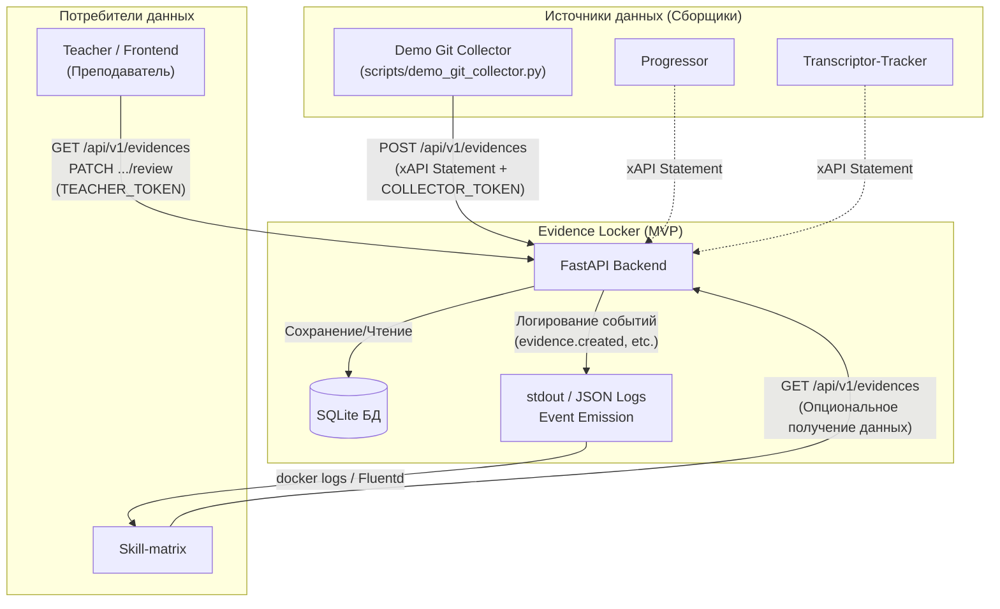
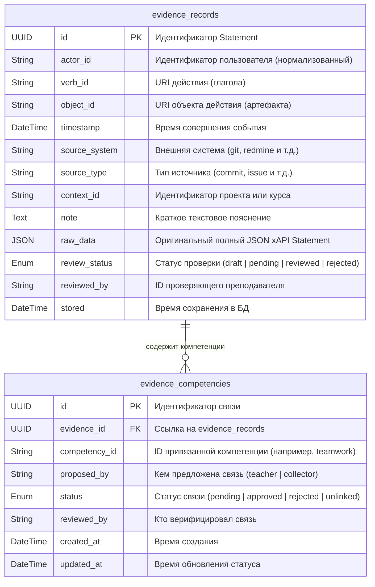

# Evidence Locker (Хранилище Свидетельств)

**Evidence Locker** — инфраструктурный бэкенд-сервис «Учебной рабочей среды», предназначенный для централизованного сбора, валидации, хранения и верификации проверяемых свидетельств деятельности учащихся (учебных артефактов). 

Модуль принимает события в стандартизированном формате **xAPI** от различных систем-сборщиков (коммиты, задачи в трекерах, расшифровки встреч), сохраняет их в локальную базу данных и предоставляет API для проверки преподавателями, а также отправляет события об изменении статусов в консоль (`stdout`) для интеграции с другими потребителями (например, визуализатором навыков **Skill-matrix**).

---

## 1. Быстрый старт (Quick Start)

Для работы с проектом используется менеджер пакетов [uv](https://github.com/astral-sh/uv).

### Шаг 1. Настройка окружения
Скопируйте шаблон файла конфигурации и задайте токены доступа:
```bash
cp .env.example .env
```
В файле `.env` содержатся статичные токены для аутентификации ролей:
* `TEACHER_TOKEN` — токен для преподавателя (просмотр, ревью, привязка компетенций).
* `COLLECTOR_TOKEN` — токен для модулей-сборщиков данных (отправка xAPI).
* `DATABASE_URL` — строка подключения к SQLite (по умолчанию `sqlite:///./data/evidence.db`).

### Шаг 2. Запуск проекта

#### Вариант А: Запуск в Docker (Рекомендуемый)
Для запуска приложения в Docker-контейнере выполните:
```bash
# Сборка образа (используется uv для быстрой сборки)
make docker-build

# Запуск контейнера (FastAPI + SQLite монтируется в папку ./data)
make docker-up
```
После запуска интерактивная документация (Swagger UI) будет доступна по адресу:  
👉 **[http://localhost:8000/docs](http://localhost:8000/docs)**

Для остановки контейнеров выполните:
```bash
make docker-down
```

#### Вариант Б: Локальный запуск
Для запуска приложения на хост-машине:
```bash
# Установка зависимостей в виртуальное окружение
make install

# Запуск сервера uvicorn в режиме автоперезапуска
make run
```
API запустится на порту `8000`.

### Шаг 3. Запуск тестов
Для прогона набора юнит- и интеграционных тестов выполните:
```bash
make test
```

---

## 2. Архитектура и интеграция

Модуль спроектирован на принципах слабой связанности (**Loose coupling**). Он не зависит от других сервисов напрямую, а общается с ними через REST API и stdout-логи.



* **Сборщики (Ingestion):** Внешние скрипты собирают факты активности (например, коммит в Git, закрытая задача в Redmine) и отправляют их по REST в формате xAPI.
* **Шина событий (Event Emission):** Вместо сложного брокера сообщений (Kafka/RabbitMQ) для MVP используется вывод логов в `stdout` в формате JSON Lines. Потребители (например, **Skill-matrix**) парсят вывод контейнера (через `docker logs` или сборщики логов Fluentd/Vector).

---

## 3. Схема базы данных

Данные хранятся в легковесной базе данных **SQLite**. Схема состоит из двух основных таблиц:



---

## 4. Профиль xAPI для Evidence Locker

Спецификация xAPI очень гибкая и требует заполнения лишь нескольких обязательных полей. Для оптимизации поиска и фильтрации Evidence Locker накладывает дополнительные ограничения на структуру (профиль xAPI).

### Ключевые особенности профиля:
1. **Нормализация Actor:** В xAPI поле `actor` может содержать идентификатор в различных форматах (через `account`, `mbox`, `mbox_sha1sum`, `openid`). Бэкенд автоматически нормализует эти данные при сохранении и извлекает первую непустую строку в колонку `actor_id`. Сборщики могут отправлять любой из этих форматов.
2. **Обязательные расширения:** Для работы бизнес-логики сборщик **обязан** передавать в `context.extensions` два параметра:
   - `source_system` (название системы, откуда берутся данные: `git`, `redmine`, `transcriptor` и др.)
   - `source_type` (тип сущности: `commit`, `task`, `document` и др.)
   Если эти поля отсутствуют, API отклонит запрос с кодом `422 Unprocessable Entity`.
3. **Контекст проекта:** Поле `context_id` извлекается из `context.context_id` или `context.project` (если первое не задано).
4. **Заметка:** Описание события извлекается из `context.extensions.note`.
5. **Передача Timestamp:** В базовом стандарте xAPI поле `timestamp` является необязательным. В профиле Evidence Locker оно также может быть опущено — в этом случае бэкенд автоматически устанавливает в качестве `timestamp` время получения запроса (текущее время UTC). Однако сборщикам рекомендуется явно передавать `timestamp` совершения действия для гарантии точной хронологии.


### Пример валидного JSON-запроса (xAPI Statement)
```json
{
  "id": "9b1deb4d-3b7d-4bad-9bdd-2b0d7b3dcb6d",
  "actor": {
    "account": {
      "name": "developer_ivan"
    },
    "mbox": "mailto:ivan@company.com"
  },
  "verb": {
    "id": "http://adlnet.gov/expapi/verbs/completed"
  },
  "object": {
    "id": "https://github.com/my-org/my-project/commit/f47ac10b58"
  },
  "context": {
    "project": "practice-project",
    "extensions": {
      "source_system": "git",
      "source_type": "commit",
      "note": "feat: add authorization dependencies"
    }
  },
  "timestamp": "2026-07-02T12:00:00Z"
}
```

---

## 5. Аутентификация и роли

Доступ к API ограничен с помощью токенов, передаваемых в заголовке `Authorization`:
```http
Authorization: Bearer <TOKEN>
```

### Матрица прав доступа к API эндпоинтам:

| Эндпоинт | Роль Collector | Роль Teacher |
| :--- | :---: | :---: |
| `POST /api/v1/evidences` | ✅ | ❌ |
| `GET /api/v1/evidences` | ❌ | ✅ |
| `PATCH /api/v1/evidences/{id}/review` | ❌ | ✅ |
| `POST /api/v1/evidences/{id}/competencies` | ✅ *(создает в статусе pending)* | ✅ *(создает в статусе approved)* |

---

## 6. Справочник API Endpoints

### 6.1. Прием свидетельств
* **URL:** `POST /api/v1/evidences`
* **Доступ:** `COLLECTOR_TOKEN`
* **Описание:** Принимает xAPI Statement, проверяет его на соответствие профилю, извлекает бизнес-поля, нормализует ID автора и сохраняет в БД со статусом `pending`.
* **Возвращаемые коды:**
  - `201 Created` — успешно сохранено. Возвращает сохраненную карточку свидетельства.
  - `422 Unprocessable Entity` — невалидный формат xAPI или отсутствие обязательных расширений (`source_system`, `source_type`).
  - `403 Forbidden` — неверный токен или недостаточные права.

### 6.2. Поиск и фильтрация свидетельств
* **URL:** `GET /api/v1/evidences`
* **Доступ:** `TEACHER_TOKEN`
* **Описание:** Получение списка записей с поддержкой фильтрации. Запрос строит динамическое SQL-соединение.
* **Query-параметры (опционально):**
  - `actor_id` — ID автора свидетельства.
  - `verb_id` — URI действия.
  - `object_id` — URI объекта (артефакта).
  - `competency_id` — ID привязанной компетенции. Возвращает только те свидетельства, которые связаны с данной компетенцией в статусах `approved` или `pending`.
  - `review_status` — статус ревью свидетельства (`draft`, `pending`, `reviewed`, `rejected`).
  - `source_system` — внешняя система (источник).
  - `context_id` — ID проекта/контекста.
* **Пример запроса:** `GET /api/v1/evidences?review_status=pending&source_system=git`

### 6.3. Модерация (Ревью) свидетельства
* **URL:** `PATCH /api/v1/evidences/{evidence_id}/review`
* **Доступ:** `TEACHER_TOKEN`
* **Тело запроса (JSON):**
  ```json
  {
    "status": "reviewed",
    "note": "Отличный коммит с качественным рефакторингом кода."
  }
  ```
* **Описание:** Преподаватель одобряет (`reviewed`) или отклоняет (`rejected`) свидетельство. Поле `reviewed_by` автоматически заполняется значением `"0"`. Поле `note` перезаписывается переданным комментарием (если передан пустой текст, заметка очищается).
* **Возвращаемые коды:** `200 OK`, `404 Not Found` (если запись не существует).

### 6.4. Привязка компетенции
* **URL:** `POST /api/v1/evidences/{evidence_id}/competencies`
* **Доступ:** `COLLECTOR_TOKEN` или `TEACHER_TOKEN`
* **Тело запроса (JSON):**
  ```json
  {
    "competency_id": "teamwork"
  }
  ```
* **Описание:** Предлагает или подтверждает связь свидетельства с компетенцией. Логика зависит от роли вызвавшего токена:
  - **Если запрос от Collector:** Связь создается в статусе `pending` (`proposed_by: "collector"`, `reviewed_by: null`). Преподаватель должен подтвердить её позже.
  - **Если запрос от Teacher:** Связь автоматически подтверждается в статусе `approved` (`proposed_by: "teacher"`, `reviewed_by: "0"`).

---

## 7. Механизм логирования событий (Event Emission)

При успешном выполнении бизнес-операций приложение выводит лог-события уровня `INFO` в стандартный вывод (`stdout`). Логи пишутся в машинно-читаемом формате **JSON Lines** (одна строка — один JSON-объект).

### Спецификация событий:

#### 1. Создание свидетельства (`evidence.created`)
Эмитится при успешном `POST /api/v1/evidences`.
```json
{"event": "evidence.created", "evidence_id": "9b1deb4d-3b7d-4bad-9bdd-2b0d7b3dcb6d", "actor_id": "developer_ivan", "source_system": "git"}
```

#### 2. Одобрение свидетельства (`evidence.reviewed`)
Эмитится при `PATCH .../review` со статусом `reviewed`.
```json
{"event": "evidence.reviewed", "evidence_id": "9b1deb4d-3b7d-4bad-9bdd-2b0d7b3dcb6d", "status": "reviewed"}
```

#### 3. Отклонение свидетельства (`evidence.rejected`)
Эмитится при `PATCH .../review` со статусом `rejected`.
```json
{"event": "evidence.rejected", "evidence_id": "9b1deb4d-3b7d-4bad-9bdd-2b0d7b3dcb6d", "status": "rejected"}
```

#### 4. Привязка компетенции (`evidence.linked`)
Эмитится при успешном `POST .../competencies`.
```json
{"event": "evidence.linked", "evidence_id": "9b1deb4d-3b7d-4bad-9bdd-2b0d7b3dcb6d", "competency_id": "teamwork"}
```

---

## 8. Демонстрационные скрипты и тестирование

В папке `scripts/` находятся утилиты для проверки и наполнения демонстрационных баз данных:

* **Заполнение базы данных мок-данными:**
  ```bash
  uv run python scripts/seed.py
  ```
  Создает в SQLite базе данных `data/evidence.db` набор тестовых записей с различными статусами для отладки фильтров.

* **Имитация работы Git-сборщика (Git Collector):**
  ```bash
  make run-demo
  ```
  Или вручную: `uv run python scripts/demo_git_collector.py`. Скрипт считывает информацию о последнем коммите в вашем локальном репозитории, формирует валидный xAPI Statement и отправляет его по REST с `COLLECTOR_TOKEN`. Приложение сохранит его в статусе `pending`, а в консоли сервера появится JSON-лог `evidence.created`.

* **Тестирование рабочего процесса (Workflow):**
  ```bash
  make run-demo-workflow
  ```
  Или вручную: `uv run python scripts/demo_workflow.py`. Демонстрирует полный цикл проверки последнего добавленного свидетельства: запрашивает его, переводит в статус `reviewed` с помощью `TEACHER_TOKEN` и привязывает компетенции.

* **Полный цикл сквозного тестирования (End-to-End):**
  ```bash
  make run-demo-all
  ```
  Запускает интерактивный пошаговый сценарий, демонстрирующий отправку коммита, фильтрацию по статусу, проверку преподавателем и привязку компетенций с выводом логов на каждом шаге.
